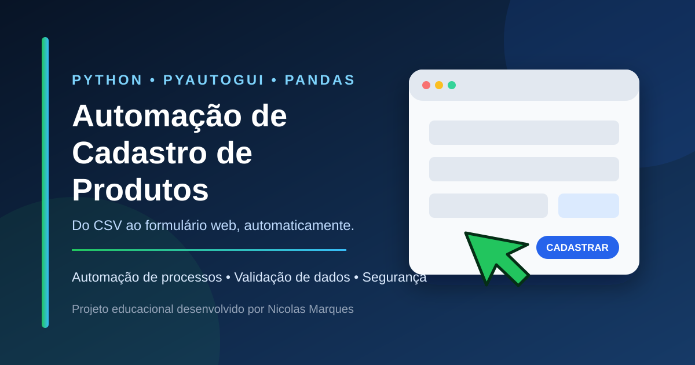

# Automação de Cadastro de Produtos


Projeto em Python que lê uma base de produtos em CSV e automatiza o cadastro de cada item em um sistema web.

## O que o projeto demonstra

- automação de teclado e mouse com PyAutoGUI;
- leitura e validação de dados com pandas;
- preenchimento repetitivo de formulários web;
- tratamento de campos opcionais;
- uso de caminhos de arquivos com `pathlib`;
- proteção de credenciais, que não ficam salvas no código;
- testes automatizados para a leitura da base de dados.

## Como funciona

1. O programa solicita o e-mail e a senha no terminal.
2. O sistema de treinamento é aberto no navegador padrão.
3. A automação realiza o login.
4. O arquivo CSV é carregado e validado.
5. Cada produto é preenchido e enviado no formulário.

O PyAutoGUI possui um mecanismo de segurança: mova o cursor rapidamente para um dos cantos da tela para interromper a execução.

## Estrutura do projeto

```text
.
├── automacao.py            # automação principal
├── auxiliar.py             # mostra a posição atual do cursor
├── produtos_exemplo.csv    # dados fictícios para demonstração
├── test_automacao.py       # testes da leitura e validação do CSV
├── requirements.txt        # dependências do projeto
└── docs/capa.svg           # imagem de apresentação
```

## Como executar

Crie um ambiente virtual e instale as dependências:

```bash
python -m venv .venv
```

No Windows:

```bash
.venv\Scripts\activate
pip install -r requirements.txt
```

Antes de executar, abra `auxiliar.py`, posicione o cursor nos campos de e-mail e código do produto e anote as coordenadas exibidas. Atualize no `automacao.py`:

```python
POSICAO_CAMPO_EMAIL = (x, y)
POSICAO_CAMPO_CODIGO = (x, y)
```

Depois execute:

```bash
python automacao.py
```

As credenciais são solicitadas no terminal. A senha não aparece enquanto é digitada e não é armazenada no projeto.

## Base de dados

O repositório inclui `produtos_exemplo.csv`, uma amostra pequena com dados fictícios. A base original usada durante o curso permanece apenas no computador local e está protegida pelo `.gitignore`.

## Como testar

```bash
python -m unittest -v
```

## Tecnologias e conceitos

Python · PyAutoGUI · pandas · CSV · pathlib · automação de processos · validação de dados · testes automatizados

Projeto desenvolvido como prática do Intensivão de Python da [Hashtag Treinamentos](https://www.hashtagtreinamentos.com/), com organização, segurança e documentação para portfólio.

Desenvolvido por [Nicolas Marques](https://github.com/NicolasMarquesSousa) · [Ver portfólio](https://github.com/NicolasMarquesSousa)
